# Preview real do BRasa na TV

Capturas originais do APK instalado na TV TCL do usuário, conectado ao servidor BRasa. Não são montagens, telas HTML ou imagens geradas.

[Ver oportunidades de UI e UX](analise-ui-ux.md) · [Abrir todos os PNGs e metadados](android-tv/1.0.35/)

## Ambiente e limites

- Sessão: 14/09/2026, horário de Brasília; cada JSON registra o instante em UTC.
- APK: `com.brasa.tv`, versão **1.0.35 (36)**; código de referência: `d8f141cc890c7b12f3b787c88160c07c474a4e00`.
- TV física TCL; identificação Android `Smart_TV_Pro` / `BeyondTV4`, Android 11 (API 30).
- Captura: **1920 × 1080**, densidade Android 320 dpi. Isso descreve a captura, não a resolução nativa do painel.
- Configuração observada: escala **90%**, densidade **Confortável**. No print 17, 110% está apenas em foco; 90% continua selecionado. Nenhuma preferência foi alterada para produzir os prints.
- Navegação por eventos equivalentes às teclas do controle remoto via ADB; catálogo e perfis reais. Nenhum PIN ou token foi capturado.
- O vídeo sai preto na captura do player, mas **o usuário confirmou que a imagem aparece na TV**. Controles e miniatura são capturados normalmente. Não interpretar o fundo preto como defeito de reprodução.
- A passagem pelo player reproduziu parte do episódio e pode atualizar o ponto assistido. Não foi uma medição controlada de estabilidade, sincronização de progresso ou qualidade de imagem. Ao terminar, retornamos à tela inicial.
- Não foram avaliados outros aparelhos, todas as escalas, teclado/ditado em uso, perfis protegidos, catálogo vazio, rede indisponível ou fim de episódio. Os prints não certificam acessibilidade nem ausência de travamentos.

Cada PNG tem um JSON com versão instalada, dimensão, origem, teclas enviadas pela chamada de captura e SHA-256. Essas teclas não constituem um roteiro completo reproduzível: foco inicial, navegação anterior e tempo de carregamento também interferem. A numeração tem lacunas porque capturas intermediárias sem interface visível foram descartadas.

## Galeria

### Perfis

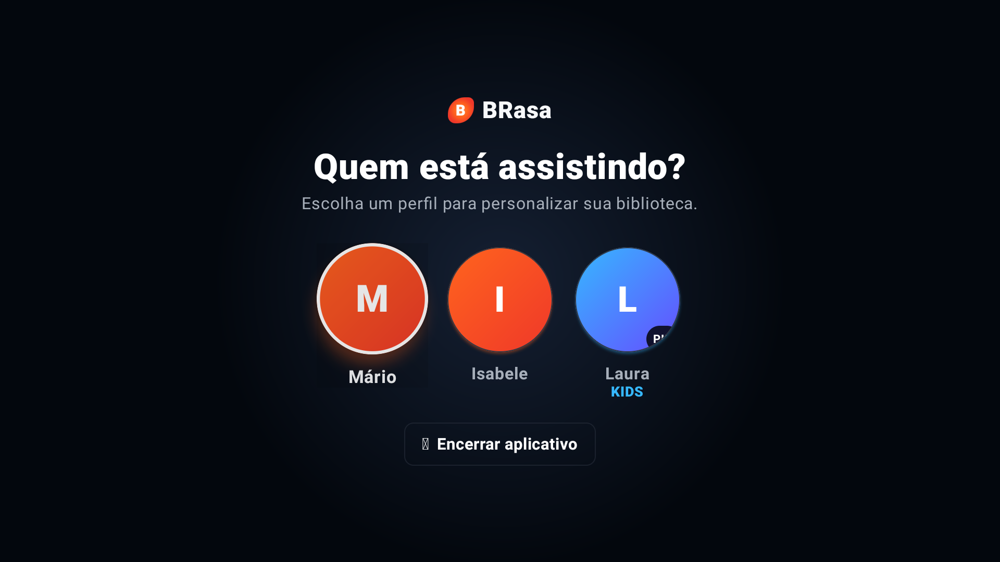

### Início

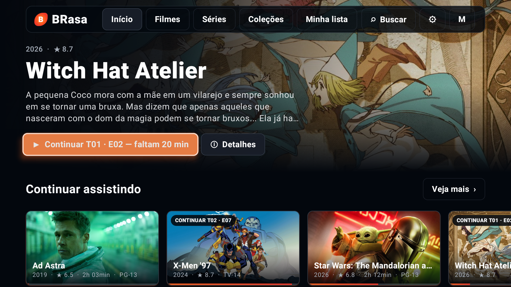

### Detalhes da série

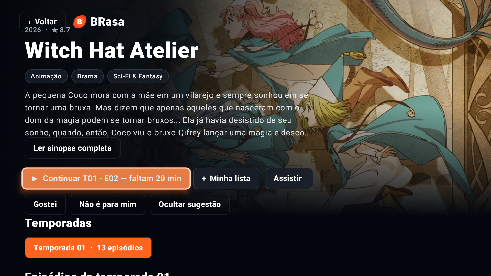

### Temporada e episódios

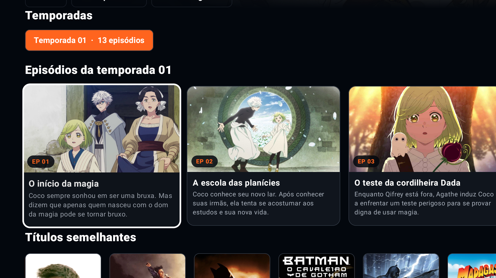

### Player e controles

O fundo preto abaixo é uma limitação da captura; a imagem estava visível na TV.

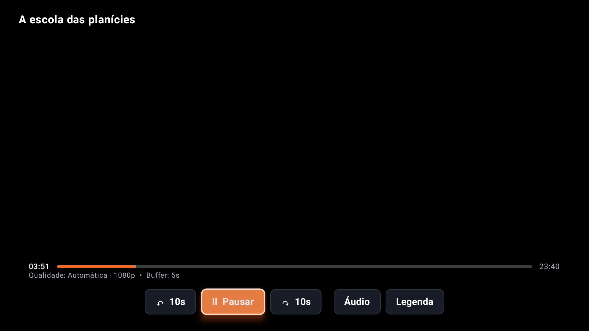

[Outra captura dos controles](android-tv/1.0.35/06-player-controles.png). O envio da tecla MEDIA_PAUSE nessa captura não comprova que a reprodução tenha sido pausada.

### Miniatura na barra de tempo

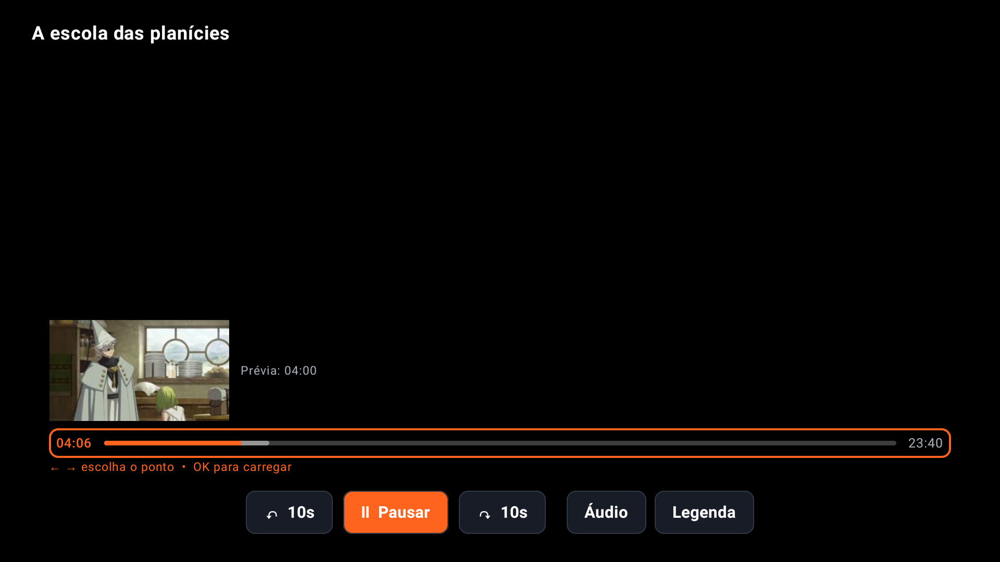

### Legendas

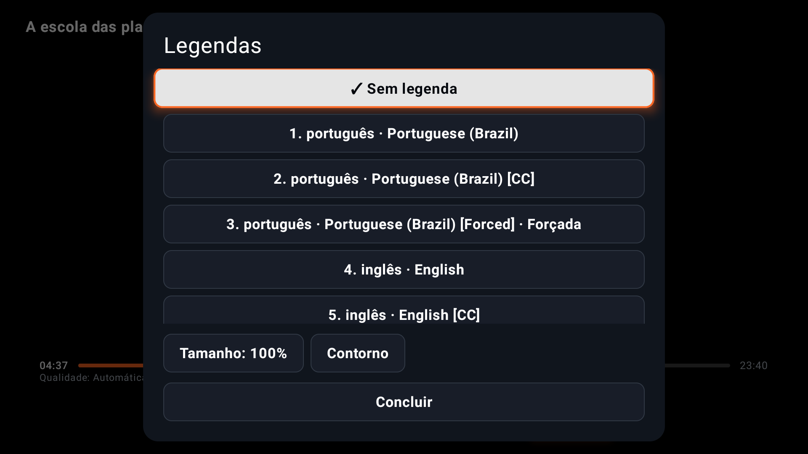

### Saída do player

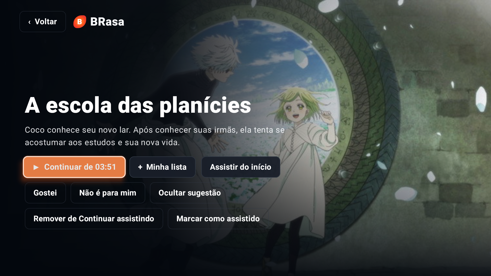

[Retorno à tela inicial](android-tv/1.0.35/13-retorno.png).

### Biblioteca de filmes

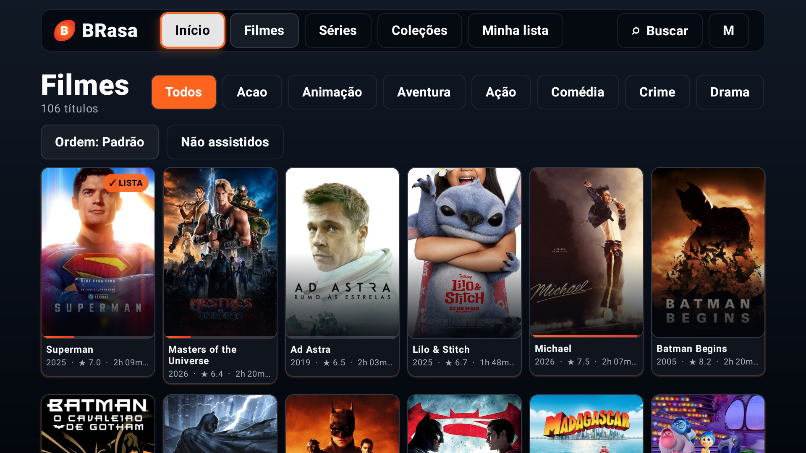

### Busca

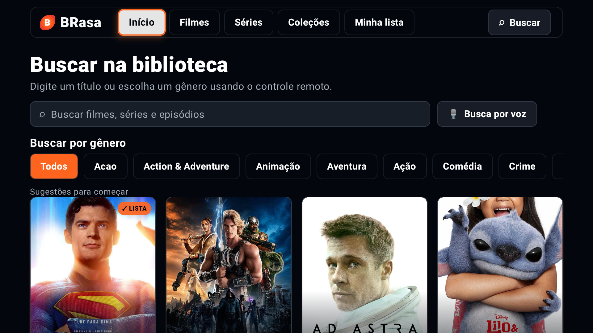

### Configurações

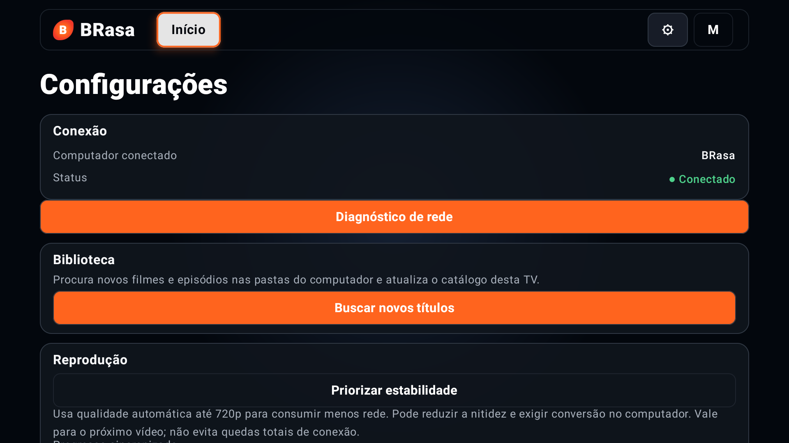

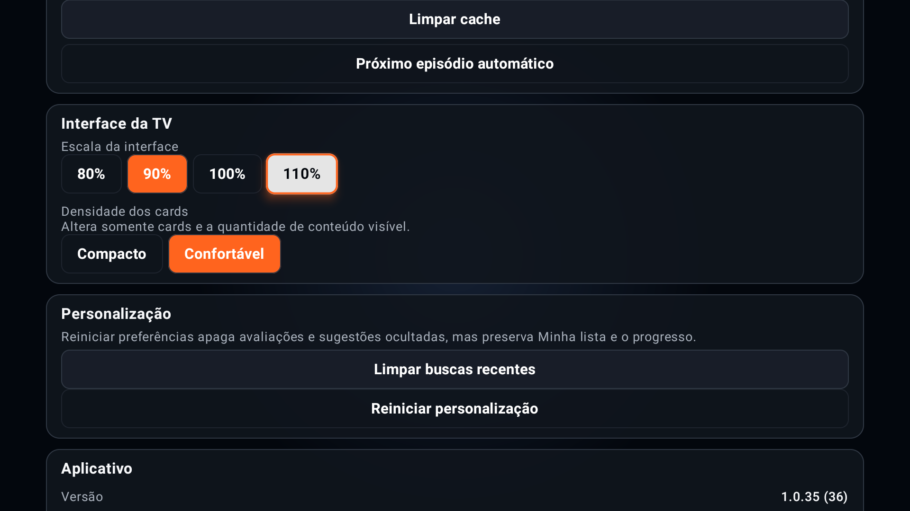

[Estado final: Brasa na tela inicial, fora do player](android-tv/1.0.35/18-inicio-final.png).

## Como atualizar as capturas

Com a depuração autorizada, identifique o dispositivo em `adb devices`, abra o Brasa e navegue até a tela desejada. Substitua o serial no exemplo:

```powershell
node scripts/capture-android-tv-preview.mjs --serial SERIAL_DA_TV --current --name 01-inicio
```

O utilitário [capture-android-tv-preview.mjs](../scripts/capture-android-tv-preview.mjs) salva na pasta da versão instalada, valida que o Brasa está em primeiro plano e recusa sobrescritas sem `--replace`. Use `--adb` para outro caminho do ADB. Opcionalmente, `--keys DPAD_DOWN,DPAD_RIGHT` navega antes da captura; qualquer tecla de confirmação pode acionar a opção em foco, portanto confira o estado antes de usá-la. A opção `--page` é exclusivamente para APK debug em emulador e gera dados demonstrativos, não equivalentes a esta galeria.

Antes de publicar, confira visualmente cada PNG, nomeie pela tela efetivamente obtida, evite telas com credenciais e mantenha o campo `file` do JSON consistente se renomear. Não substitua a área preta do player por imagens artificiais.

## Verificação desta entrega

- `npm test`: **45/45 suítes aprovadas** nesta sessão.
- Sintaxe do utilitário de captura verificada com `node --check`.
- PNGs inspecionados visualmente; dimensões e hashes conferidos contra os JSONs.
- Nenhuma proposta de UI/UX foi implementada e nenhum novo APK foi instalado nesta etapa.
